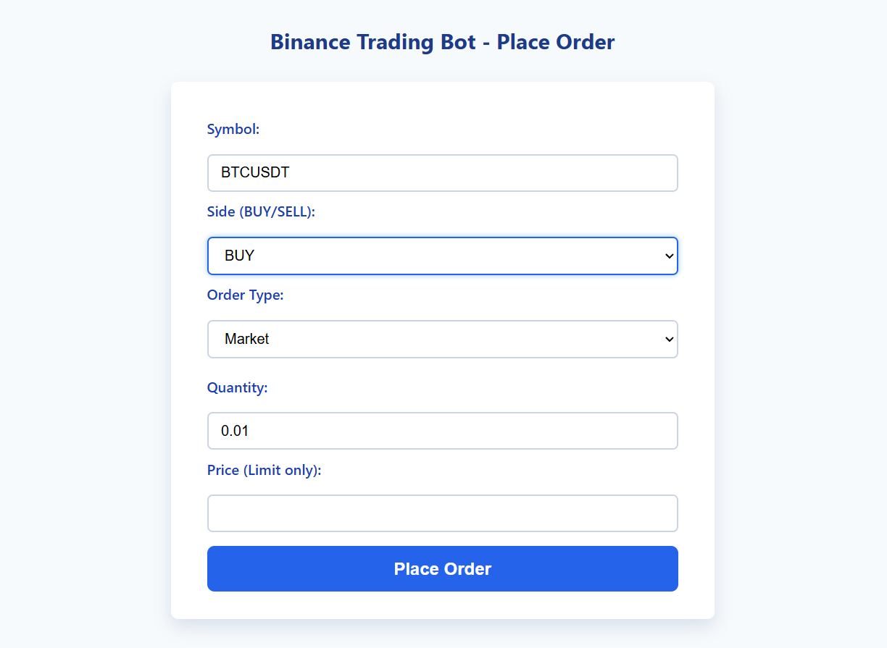
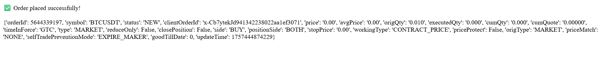
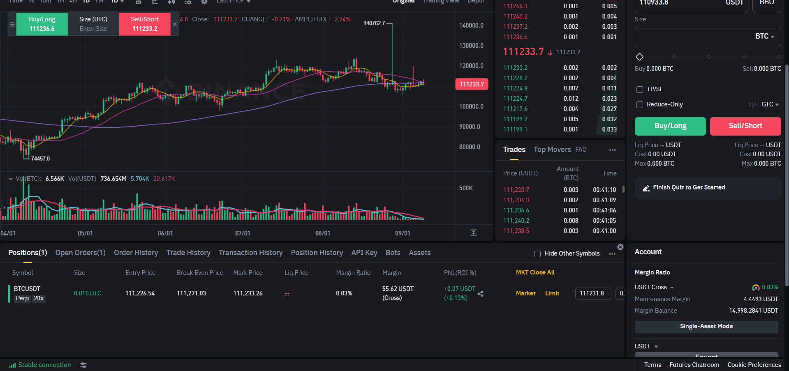

# Binance Trading Bot

## Project Overview

### Purpose of the Project
The purpose of this project is to build a **Binance Trading Bot** that interacts with the **Binance Futures Testnet API**. The bot allows users to place different types of orders (market, limit, stop-limit, OCO, TWAP, grid) through a **Flask web interface**. The bot is designed for **educational purposes**, helping users automate the process of trading in a simulated environment.

The bot supports:
- **Basic Orders**: Market and Limit orders.
- **Advanced Orders**: Stop-Limit, One-Cancels-Other (OCO), Time-Weighted Average Price (TWAP), and Grid trading.
- **Logging and Error Handling**: Logs every request and response for transparency and debugging.

### Key Technologies
- **Python**: Programming language used.
- **Flask**: For the web interface and backend handling.
- **Binance API**: For interacting with the Binance Futures Testnet.
- **HTML/CSS**: For building the frontend.
- **ReportLab**: Used to generate the final **report.pdf**.

---

## Installation Instructions

### Prerequisites
Before running the bot, make sure you have the following installed:
- **Python 3.6+**
- **pip** (Python package manager)

### 1. Clone the Repository

```bash
git clone https://github.com/yourusername/binance-trading-bot.git
cd binance-trading-bot
```

### 2. Set Up a Virtual Environment

It’s recommended to create a virtual environment for this project to manage dependencies:

```bash
python -m venv venv
```
Activate the virtual environment:

- ##### Windows:
```bash
.\venv\Scripts\activate
```

- ##### macOS/Linux:
```bash
source venv/bin/activate
```

### 3. Install Dependencies
Once the virtual environment is activated, install the required dependencies:

```bash
pip install -r requirements.txt
```

### 4. Set Up Binance Testnet API Keys

1. Go to the [Binance Testnet Futures](https://testnet.binancefuture.com/en/futures/BTCUSDT) and create a Testnet account if you don’t have one.

2. Generate API keys and save them in a .env file.

```ini
BINANCE_API_KEY=your_testnet_api_key_here
BINANCE_API_SECRET=your_testnet_api_secret_here
```

### 5. Run the Bot
Now you’re ready to run the bot. Start the Flask server by running the following command:

```bash
python src/app.py
```

The bot will start running on http://127.0.0.1:5000/

---
## Screenshots
### Screenshot 1: Flask UI



### Screenshot 2: Flask UI after placing an order



### Screenshot 3: Order status in Binance Testnet



---

### Usage

**1.** Open the Flask UI by navigating to http://127.0.0.1:5000/ in your browser.

**2.** Fill out the order form by entering the symbol (e.g., BTCUSDT), side (BUY or SELL), order type (Market, Limit, etc.), and other details.

**3.** Place your order by clicking the "Place Order" button.

**4.** Check the order status in the Binance Testnet dashboard.

---

### Order Types Supported

- **Market Orders:** Execute immediately at the current market price.

- **Limit Orders:** Place an order at a specific price.

- **Stop-Limit Orders:** Trigger a limit order once a stop price is reached.

- **OCO Orders:** Place two orders (e.g., Take Profit and Stop Loss) where one cancels the other.

- **TWAP Orders:** Split large orders into smaller parts and execute over time.

- **Grid Trading:** Place multiple limit orders at set price intervals.

---

### Error Handling

Errors are logged and displayed on the UI. Some common errors include:

- **API errors** (e.g., Invalid API key).

- **Notional errors** (e.g., insufficient order value for Binance Futures).

All errors are written to the bot.log file.

---

### Logging

The bot logs all actions and errors in the bot.log file. You can check the log for:

- **Order status:** Successful order placements.

- **Errors:** Issues such as invalid input or API-related errors.

---

### Challenges Faced

During the development of this bot, some challenges were encountered:

- **API Errors:** Ensuring the API keys were correctly set up and had the proper permissions.

- **Handling Timeouts:** The Binance Testnet API occasionally timed out, requiring longer wait times for requests.

- **Notional Value:** Binance requires a minimum notional value for orders, which had to be handled programmatically to prevent errors.

---
### Report and Documentation

The report.pdf contains a detailed explanation of the bot, including:

- **How the bot works.**

- **Code breakdown** of each order type.

- **Screenshots** of the Flask UI and the Binance Testnet order status.

---
### Testing the Bot

To test the bot:

**1.** Follow the Installation Instructions above to set up the project.

**2.** Place a Market or Limit order via the web interface.

**3.** Check your Binance Testnet account for order status.

## License

This project is licensed under the **MIT License** - see the [LICENSE](LICENSE) file for details.

**Author**: Amit Raj

The **MIT License** is a permissive free software license, allowing you to use, modify, and distribute the project. It comes with no warranty and is provided "as-is".
